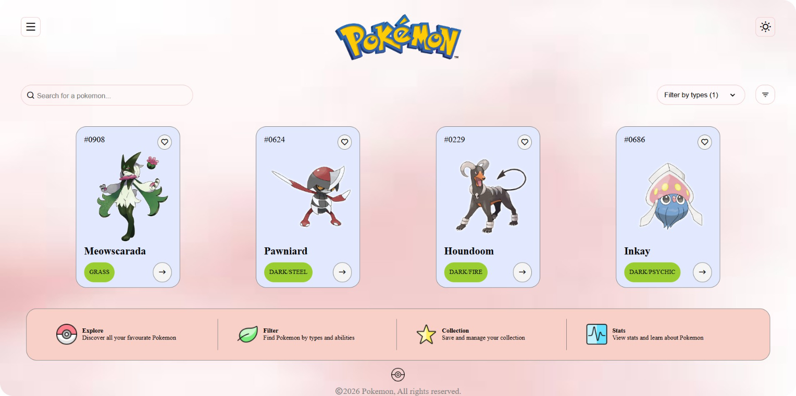

# Pokemon Explorer UI ⚡

A modern Pokemon-inspired web interface built using HTML5 and CSS3.  
This project focuses on card-based layouts, UI composition, themed styling, and interactive dashboard design.

## 💻 Preview

  

## ✨ Features

- Pokemon Card Layout
- Search & Filter UI
- Modern Dashboard Design
- Interactive UI Elements
- Themed Visual Styling
- Information Stats Section
- Clean Card-Based Interface

## 🛠️ Tech Stack

- HTML5
- CSS3
- Remix Icons

## 📚 Skills Demonstrated

- Flexbox Layouts
- Card UI Design
- UI Composition
- Themed Interface Design
- Positioning & Alignment
- Modern Styling Techniques

## 👨‍💻 Author

Sudhanshu Shukla

GitHub: https://github.com/ersudhanshushukla
