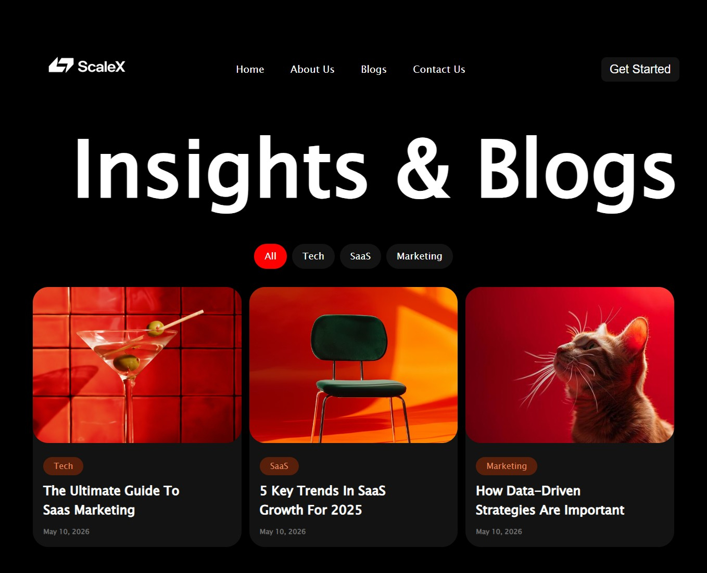

# ScaleX Blog UI 🚀

A modern SaaS blog landing page built using HTML5 and CSS3.  
This project focuses on clean layouts, card-based UI design, typography, and modern dark-themed interfaces.

## 💻 Preview

  

## ✨ Features

- Modern SaaS Blog UI
- Dark Theme Design
- Card-Based Layout
- Blog Category Filters
- Clean Typography
- Minimal Interface Design
- Modern Content Cards

## 🛠️ Tech Stack

- HTML5
- CSS3

## 📚 Skills Demonstrated

- Flexbox Layouts
- Card UI Design
- Typography Styling
- Modern Dark UI
- Content Structuring
- UI Composition

## 👨‍💻 Author

Sudhanshu Shukla

GitHub: https://github.com/ersudhanshushukla
