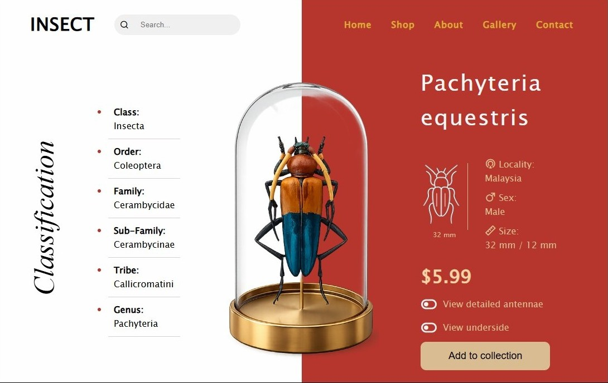

# INSECT Showcase UI 🪲

A modern insect showcase landing page built using HTML5 and CSS3.  
This project focuses on creative layouts, visual storytelling, typography, and modern UI composition.

## 💻 Preview

  

## ✨ Features

- Split Screen Layout
- Modern Product Showcase UI
- Creative Typography
- Detailed Information Panel
- Minimal & Elegant Design
- Interactive Buttons & Icons
- Visual Composition Design

## 🛠️ Tech Stack

- HTML5
- CSS3
- Remix Icons

## 📚 Skills Demonstrated

- Flexbox Layouts
- Positioning & Alignment
- UI Composition
- Typography Styling
- Product Showcase Design
- Modern Visual Design

## 👨‍💻 Author

Sudhanshu Shukla

GitHub: https://github.com/ersudhanshushukla
