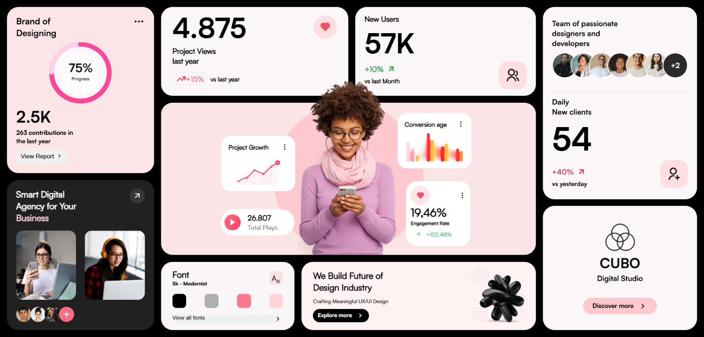

# Creative Dashboard UI 🎨

A modern dashboard UI built using HTML5 and CSS3.  
This project focuses on advanced CSS Grid layouts, positioning, modern card components, and clean visual design.

## 💻 Preview

  

## ✨ Features

- Advanced CSS Grid Layout
- Dashboard Card Components
- Floating UI Elements
- Custom Typography
- Modern Visual Design
- Interactive Sections

## 🛠️ Tech Stack

- HTML5
- CSS3
- Remix Icons

## 📚 Skills Demonstrated

- CSS Grid & Flexbox
- Complex Layout Structuring
- Positioning & Layering
- Modern UI Development
- Component-Based Styling

## 👨‍💻 Author

Sudhanshu Shukla

GitHub: https://github.com/ersudhanshushukla
