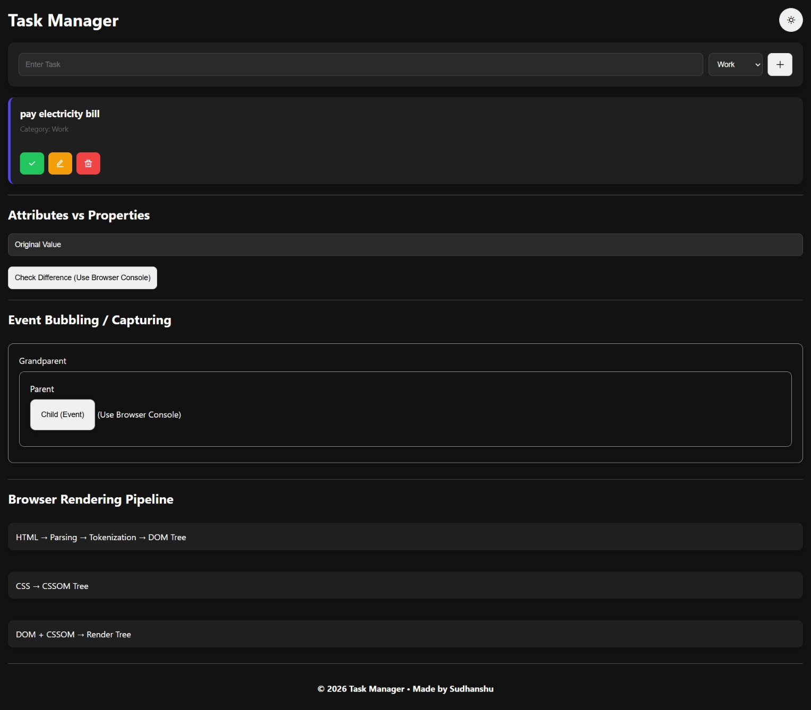

# 📋 DOM Explorer - Interactive Task Manager

A fully interactive Task Manager Application built using **HTML, CSS, and Vanilla JavaScript**. This project demonstrates core browser and DOM concepts including DOM Manipulation, Event Handling, Event Delegation, Event Bubbling, Event Capturing, Attributes vs Properties, Browser Rendering Pipeline, and Local Storage.

## 🌐 Live Demo
https://taskmanager-sudhanshu.netlify.app/

## 💻 Preview
<p align="center">  </p>

## ✨ Features

* Add New Tasks
* Edit Existing Tasks
* Delete Tasks
* Mark Tasks as Completed
* Category Selection
* Dark / Light Theme Toggle
* Local Storage Integration
* Theme Persistence
* Event Delegation
* Event Bubbling Demonstration
* Event Capturing Demonstration
* Browser Rendering Pipeline Visualization
* Attributes vs Properties Demonstration
* Responsive UI
* Remix Icons Integration

## 🛠 Tech Stack

* HTML5
* CSS3
* JavaScript (ES6)
* DOM API
* Local Storage
* Remix Icons

# 📚 Concepts Covered

## DOM Manipulation

The application dynamically creates, updates, and removes DOM elements using JavaScript.

Methods used:

```javascript
createElement()
append()
appendChild()
remove()
classList.add()
classList.toggle()
```

## Attributes vs Properties

The project demonstrates the difference between HTML attributes and DOM properties.

### Attribute

Attributes represent the original values written inside HTML.

```html
<input value="Original Value">
```

```javascript
input.getAttribute("value");
```

### Property

Properties represent the current runtime state of an element.

```javascript
input.value;
```

If the user changes the input value, the property changes while the original attribute remains unchanged.

# 🌐 Browser Rendering Pipeline

The Browser Rendering Pipeline explains how a browser converts HTML and CSS into visible content on the screen.

## 1. Parsing

The browser reads the HTML document from top to bottom and analyzes its structure.

Example:

```html
<h1>Hello World</h1>
```

## 2. Tokenization

The browser converts HTML into small units called tokens.

Example:

```html
<h1>Hello World</h1>
```

becomes:

```text
<h1>
Hello World
</h1>
```

## 3. DOM Tree

After tokenization, the browser creates a DOM (Document Object Model) Tree.

Example:

```text
Document
 └── html
      └── body
           └── h1
```

The DOM Tree represents the structure of the webpage and allows JavaScript to interact with elements.

## 4. CSSOM Tree

The browser parses CSS and creates a CSS Object Model (CSSOM) Tree.

Example:

```css
h1 {
  color: blue;
}
```

CSSOM stores all styling information associated with webpage elements.

## 5. Render Tree

The browser combines:

```text
DOM Tree
    +
CSSOM Tree
```

to create:

```text
Render Tree
```

The Render Tree contains only visible elements and their computed styles.

## Rendering Flow Summary

```text
HTML
 ↓
Parsing
 ↓
Tokenization
 ↓
DOM Tree

CSS
 ↓
CSSOM Tree

DOM Tree + CSSOM Tree
 ↓
Render Tree
 ↓
Layout
 ↓
Paint
 ↓
Screen Output
```

# 🔄 Event Propagation

This project demonstrates how events travel through the DOM.

## Event Bubbling

In Event Bubbling, the event starts from the target element and moves upward through its ancestors.

Example:

```text
Child
 ↓
Parent
 ↓
Grandparent
```

Output:

```text
Child Bubbling
Parent Bubbling
Grandparent Bubbling
```

## Event Capturing

In Event Capturing, the event travels from outer elements toward the target element.

Example:

```text
Grandparent
 ↓
Parent
 ↓
Child
```

Output:

```text
Grandparent Capturing
Parent Capturing
Child Capturing
```

## Event Delegation

Instead of attaching multiple event listeners to every task button, a single event listener is attached to the parent task container.

Example:

```javascript
taskContainer.addEventListener("click", (e) => {
  // Handle task actions
});
```

Benefits:

* Better Performance
* Reduced Memory Usage
* Cleaner Code
* Supports Dynamically Added Elements

# 💾 Local Storage Integration

Tasks are stored in Local Storage so that they remain available after page refresh.

Methods used:

```javascript
localStorage.setItem()
localStorage.getItem()
JSON.stringify()
JSON.parse()
```

Theme preference is also stored in Local Storage.

# 💡 Skills Demonstrated

* DOM Manipulation
* Dynamic UI Creation
* Event Handling
* Event Delegation
* Event Bubbling
* Event Capturing
* Local Storage Management
* Theme Switching
* Browser Rendering Concepts
* JavaScript Fundamentals

# 🚀 Future Improvements

* Task Search
* Task Filtering
* Task Statistics
* Due Dates
* Drag & Drop Support
* Task Priorities

## 👨‍💻 Author

**Sudhanshu Shukla**

[GitHub](https://github.com/ErSudhanshuShukla) | [LinkedIn](https://www.linkedin.com/in/ErSudhanshuShukla)
